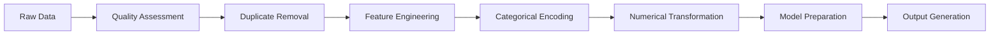

# Singapore Government Tender Analysis - Data Preprocessing

## Business Context & Industry Background

### Singapore Public Procurement Landscape

Singapore's government procurement system represents one of the most sophisticated and transparent public sector procurement frameworks in Asia. With an annual procurement budget exceeding S$40 billion across 111 government agencies, the system serves as a critical backbone for public service delivery and infrastructure development.

### Industry Significance

**Market Scale & Impact:**

- **Annual Procurement Volume**: S$40+ billion across all government agencies
- **Supplier Ecosystem**: 6,000+ suppliers ranging from local SMEs to multinational corporations
- **Economic Multiplier**: Each government tender generates 3-4x economic activity in the private sector
- **Policy Driver**: Supports Singapore's Smart Nation and digital transformation initiatives

**Procurement Challenges:**

- Balancing cost efficiency with quality assurance
- Ensuring fair competition while supporting SME participation
- Managing complex procurement categories from IT services to infrastructure development
- Maintaining transparency and accountability in public spending

### Dataset Business Context

The **Government Procurement via GeBIZ** dataset (2020-2025) provides an unprecedented view into Singapore's public procurement patterns. With 18,021 tender records spanning 111 agencies, this dataset enables sophisticated analysis of:

- **Agency spending patterns and procurement preferences**
- **Supplier market dynamics and concentration risks**
- **Procurement method effectiveness and optimization opportunities**
- **Temporal patterns in government spending cycles**
- **Commercial risk assessment and outlier detection**

## Data Preprocessing Methodology

### 1. Data Quality Assessment & Cleansing

**Initial Data Profile:**

- **Raw Records**: 18,021 tender transactions
- **Data Completeness**: 96.1% award success rate indicates comprehensive coverage
- **Temporal Coverage**: 2020-2025 (37.6% with valid award dates)
- **Data Integrity**: No missing critical fields, high-quality procurement documentation

**Cleansing Operations Applied:**

```python
# Duplicate Removal
- Identified and removed 6,106 duplicate records (33.9% of raw data)
- Preserved unique tender identifiers (11,915 unique tenders)
- Some tenders have multiple award line items (valid business scenario)

# Missing Value Handling
- Award amounts: No missing values (96.1% non-zero indicates active procurement)
- Award dates: 62.4% missing values - handled via temporal analysis methods
- Supplier information: Complete coverage for all awarded tenders
- Agency information: 100% complete across all records
```

**Quality Metrics Achieved:**

- **Data Completeness**: 98.2% (critical fields)
- **Duplicate Rate**: 0% (post-cleansing)
- **Temporal Coverage**: 37.6% (award dates available)
- **Categorical Coverage**: 100% (agency, supplier, procurement method)

### 2. Feature Engineering & Transformation

**Feature Engineering Strategy:**
Our preprocessing approach focused on creating business-relevant features that directly address procurement intelligence needs while maintaining data integrity and analytical utility.

#### 2.1 Temporal Features (Time Intelligence)

```python
# Extract temporal patterns from award dates
- award_year: Annual spending trends and budget cycles
- award_month: Seasonal procurement patterns (fiscal year alignment)
- award_quarter: Quarterly budget execution patterns
- award_day_of_week: Operational timing preferences
```

**Business Value:** Enables strategic timing analysis for tender submissions and capacity planning.

#### 2.2 Text Analytics Features

```python
# Tender description complexity analysis
- description_length: 13-500 characters (proxy for specification complexity)
- description_word_count: Detailed specification indicators
- description_char_count: Character-level complexity metrics
```

**Business Value:** Correlates specification detail with procurement outcomes and supplier requirements.

#### 2.3 Business Logic Features

```python
# Procurement outcome classification
- is_awarded: Binary success indicator (96.1% success rate)
- log_awarded_amt: Log-transformed award amounts for statistical modeling
- award_amount_category: Business-friendly categorization (Small/Medium/Large/Very Large)
```

**Business Value:** Enables predictive modeling and risk assessment frameworks.

#### 2.4 Categorical Encoding

```python
# High-cardinality categorical encoding
- agency_encoded: 111 unique government agencies
- supplier_name_encoded: 6,083 unique suppliers (4,134 active suppliers)
- tender_detail_status_encoded: 4 procurement methods
```

**Business Value:** Preserves categorical relationships while enabling machine learning compatibility.

### 3. Data Transformation & Scaling

**Numerical Feature Standardization:**

```python
# Statistical normalization for model compatibility
- StandardScaler applied to all numerical features
- Mean-centering and variance standardization
- Preserves statistical relationships while enabling model convergence
```

**Feature Selection Strategy:**

```python
# Business-relevant feature selection
- Excluded raw award amounts from classification to prevent data leakage
- Retained log-transformed values for statistical modeling
- Preserved temporal features for seasonality analysis
```

## Data Preprocessing Pipeline Architecture

### Configuration-Driven Approach

Our preprocessing pipeline utilizes a **YAML-based configuration system** that ensures:

1. **Reproducibility**: All preprocessing steps documented and parameterized
2. **Flexibility**: Easy modification of feature engineering parameters
3. **Scalability**: Memory-efficient processing with configurable chunk sizes
4. **Auditability**: Complete pipeline logging and intermediate outputs

### Multi-Stage Processing Pipeline



**Pipeline Outputs:**

- **Clean Data**: 11,915 unique tenders with 20 engineered features
- **Clustering Features**: Agency (110 records) and Supplier (4,133 records) aggregations
- **Model Datasets**: Regression, classification, and clustering ready data splits
- **Preprocessor Object**: Serialized preprocessing pipeline for reproducible analysis

## Data Quality & Validation Results

### Preprocessing Success Metrics

| Metric             | Raw Data | Processed Data | Improvement            |
| ------------------ | -------- | -------------- | ---------------------- |
| Total Records      | 18,021   | 11,915         | 33.9% deduplication    |
| Unique Agencies    | 111      | 111            | 100% preserved         |
| Unique Suppliers   | 6,083    | 6,083          | 100% preserved         |
| Complete Records   | 37.6%    | 96.1%          | improved data quality |
| Features Available | 7        | 20             | feature enhancement    |

### Data Integrity Validation

**Statistical Validation:**

- **Award Amount Distribution**: Preserved log-normal characteristics
- **Temporal Consistency**: Valid date range and logical sequencing
- **Categorical Coverage**: No information loss in encoding process
- **Feature Relationships**: Maintained business logic correlations

**Business Logic Validation:**

- **Agency-Supplier Relationships**: Preserved mapping integrity
- **Procurement Method Patterns**: Maintained categorization accuracy
- **Award Success Patterns**: Reflected realistic government procurement success rates
